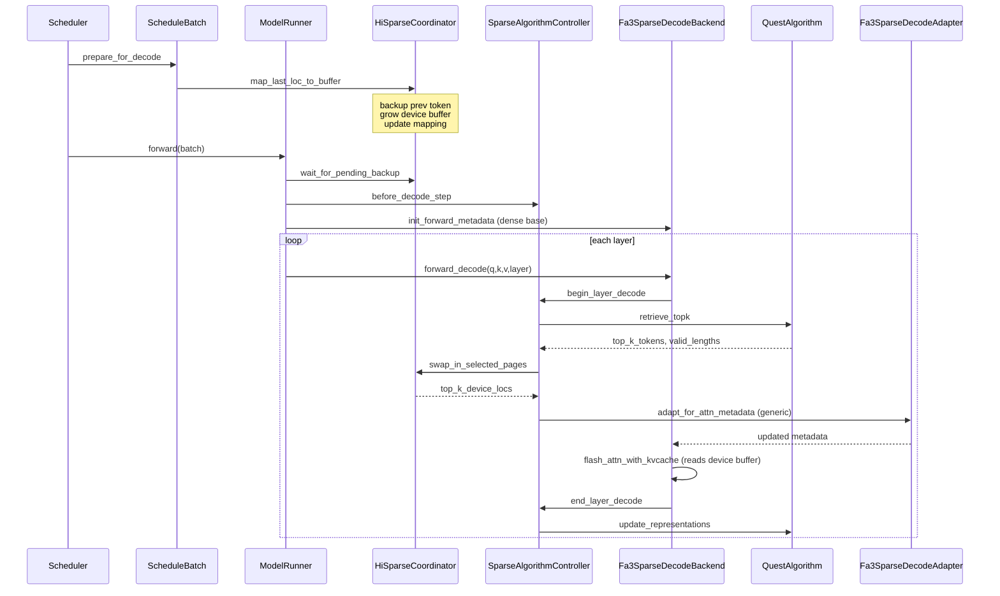

# HiSparse 非原生稀疏注意力扩展设计文档

> 目标：以现有 HiSparse 框架为基础，扩展支持**非原生稀疏注意力算法**（如 Quest、H2O、SnapKV 等），首版以 **Qwen 系列模型 + Quest 算法 + FlashAttention-3 后端** 为落地 case。
>
> 本设计的核心约束：
> 1. **不影响现有 HiSparse + NSA(DSA) 路径**（DeepSeek V3.2 / GLM-5 继续走原生稀疏）。
> 2. **只新增一个协调器对外入口** —— `HiSparseCoordinator`；算法接入层作为 `HiSparseCoordinator` 的内部模块。
> 3. **FA3 Adapter 与算法解耦**，只从 metadata 层面操作 attention backend，任何能产出「token 级 top-k 索引」的算法都可复用。
> 4. 首版仅支持 **单实例部署、page_size=1、bf16 KV**；PD disaggregation 与其他算法留作后续迭代。

---

## 1. 背景与动机

### 1.1 现有 HiSparse 回顾

现有 HiSparse（参见 [hisparse_guide.md](hisparse_guide.md)）的核心机制：

- 每个 decode 请求在 GPU 只保留一个**固定大小**的 hot KV buffer（如 4K tokens），完整 KV 放在 **CPU pinned host 池**。
- 每个 decode step 的每一层，用 [hisparse.cuh](../../python/sglang/jit_kernel/csrc/hisparse.cuh) 中的 `load_cache_to_device_buffer` kernel 按 top-k 把所需 KV 从 host 换入 device buffer，并用 LRU 策略维护热态。
- 上一步产生的新 token 异步 backup 到 host。
- Top-k 的产生完全依赖 **DeepSeek Sparse Attention (DSA) 模型自带的 indexer**，属于"原生稀疏"。

约束：
- 仅支持 DSA 架构模型（[server_args.py](../../python/sglang/srt/server_args.py) 中由 `is_deepseek_nsa` 守卫）。
- 仅支持 `flashmla_sparse` attention backend。
- 仅部署于 PD disaggregation 的 decode 实例。

### 1.2 新路径的目标

把 HiSparse 的"分层 KV + IO kernel"复用到**非原生稀疏**算法上：

- 面向 **MHA/GQA 模型**（以 Qwen2/Qwen3 系列为首批）。
- **算法可插拔**：Quest 作为首个落地实现，后续可在不改主路径的前提下增加 H2O、SnapKV 等。
- **Attention backend 换成 FA3**（`flash_attn_with_kvcache`），通过 adapter 层改写 metadata 把稀疏性注入进来，不改 FA3 本身的 kernel 调用。
- **单实例部署**：Prefill 阶段走 dense FA3，全量 KV 保留在 GPU；Prefill 结束后把 KV 迁移到 host 池，释放 GPU 全量 KV，只保留 hot buffer；Decode 按 HiSparse 的方式做 swap-in。

### 1.3 scope

**本版支持**：
- 模型：Qwen2 / Qwen3 的 text-only 变体（MHA、GQA）。
- 算法：Quest。
- Backend：FA3（`fa3_sparse_decode` backend，继承自 `FlashAttentionBackend`）。
- KV：`kv-cache-dtype=bfloat16`、`page_size=1`。
- 部署：单实例。

**本版不做**：
- DSA 原生稀疏路径不做任何改动。
- 不引入 PD disaggregation、不兼容原 HiSparse 的 `admit_request_direct` / `send_kvcache_hisparse`。
- 不新增 CUDA kernel（仅在 [hisparse.py](../../python/sglang/jit_kernel/hisparse.py) 中补一个 MHA 绑定，底层复用 `hisparse.cuh` 的 `IsMLA=false` 分支）。

---

## 2. 总体架构

### 2.1 模块分层

本设计把 `HiSparseCoordinator` 作为稀疏 decode 的**统一管理根节点**。从大模块关系上看，它下面分成一块共享的 HiSparse IO/KV 管理能力，以及两条互斥的 sparse attention 路径：原生 DSA/NSA 路径直接复用现有模型 indexer；非原生 sparse decode 路径额外挂一个算法接入模块。

```text
                   Scheduler / ModelRunner / ForwardBatch
                                  │
                                  ▼
              ┌──────────────────────────────────────┐
              │          HiSparseCoordinator          │
              │  唯一外部入口；管理请求生命周期和 IO  │
              └──────────────────────────────────────┘
                         │                    │
                         │                    │ optional, sparse_decode only
                         │                    ▼
                         │      ┌────────────────────────────────┐
                         │      │   SparseAlgorithmController     │
                         │      │   算法 + backend adapter 组合   │
                         │      └────────────────────────────────┘
                         │                    │
                         │        ┌───────────┴───────────┐
                         │        ▼                       ▼
                         │  Quest / H2O / SnapKV     FA3 Sparse Adapter
                         │  产出 token top-k          改写 attention metadata
                         │        │                       │
                         ▼        ▼                       ▼
        ┌─────────────────────────────────────────────────────────┐
        │                 共享 HiSparse IO / KV 层                 │
        │ host pool / device hot buffer / LRU / backup / swap-in   │
        │ HiSparseNSATokenToKVPool 或 HiSparseMHATokenToKVPool     │
        └─────────────────────────────────────────────────────────┘
                         ▲                        │
                         │                        ▼
        ┌──────────────────────────┐   ┌──────────────────────────┐
        │ 原生 DSA / NSA 路径       │   │ 非原生 sparse_decode 路径 │
        │ 模型内置 indexer          │   │ Fa3SparseDecodeBackend    │
        │ flashmla_sparse backend   │   │ flash_attn_with_kvcache   │
        └──────────────────────────┘   └──────────────────────────┘
```

对应到当前实现：

- **DSA/NSA 原生路径**：`--enable-hisparse` 时 `ModelRunner` 创建 `HiSparseCoordinator(mode="dsa_native", algorithm_controller=None)`，device pool 是 `HiSparseNSATokenToKVPool`，host pool 是 `MLATokenToKVPoolHost`，top-k 来源仍是模型/NSA backend 自带 indexer。
- **非原生 sparse decode 路径**：`--enable-sparse-decode` 时先由 `build_sparse_algorithm_controller()` 创建 `SparseAlgorithmController(algorithm=QuestAlgorithm, adapter=Fa3SparseDecodeAdapter)`，再注入 `HiSparseCoordinator(mode="sparse_decode", algorithm_controller=...)`；controller 只驱动算法与 metadata adapter，不拥有 host pool、device hot buffer 或 swap-in kernel。

### 2.2 与原 HiSparse 的关系

- **外部视角单一协调器**：`Scheduler`、`ModelRunner`、`ForwardBatch` 只感知 `HiSparseCoordinator`，和现有 DSA 路径一致。
- **双路径共存**：
  - DSA 模型 + `--enable-hisparse` → `HiSparseCoordinator` 不创建 `SparseAlgorithmController`，走原生 NSA 路径（与当前行为完全一致）。
  - 非 DSA 模型 + `--enable-sparse-decode` → `HiSparseCoordinator` 内部创建并持有 `SparseAlgorithmController`，attention backend 通过 controller 注入 top-k + 改 metadata。
- **合并命名**：删除原 [sparsity/core/sparse_coordinator.py](../../python/sglang/srt/mem_cache/sparsity/core/sparse_coordinator.py) 中的独立 `SparseCoordinator`（该类目前未被主路径接入），其文件改为放置 `SparseAlgorithmController`。

### 2.3 数据流总览

```mermaid
flowchart TB
  subgraph Server_Init
    SA["ServerArgs<br/>--enable-sparse-decode<br/>--sparse-decode-config"] --> GAB["ServerArgs.get_attention_backends()<br/>decode backend auto-rewritten<br/>to fa3_sparse_decode"]
    SA --> MR[ModelRunner.initialize]
    MR --> KVP["HiSparseMHATokenToKVPool<br/>full logical space + device hot buffer"]
    MR --> HSC["HiSparseCoordinator<br/>host_pool + swap_in_kernel"]
    HSC --> CTL["SparseAlgorithmController<br/>algorithm + adapter"]
    GAB --> AR["attention_registry<br/>fa3_sparse_decode -> Fa3SparseDecodeBackend"]
  end
  subgraph Prefill_Phase
    P1[prefill request] --> P2["dense FA3<br/>write full KV into HiSparseMHATokenToKVPool<br/>(full logical rows)"]
    P2 --> P3["per layer: algorithm.construct_representations<br/>(read K from same pool)"]
    P3 --> P4["prefill finished<br/>HiSparseCoordinator.admit_request_from_gpu<br/>migrate KV -> host, alloc device_buffer<br/>release full logical rows"]
  end
  subgraph Decode_Step
    D1["schedule_batch.prepare_for_decode<br/>-> coord.map_last_loc_to_buffer<br/>  backup prev token + grow device buffer"]
    D1 --> D2["model_runner._forward_raw<br/>coord.wait_for_pending_backup"]
    D2 --> D3["attn_backend.init_forward_metadata<br/>dense base metadata"]
    D3 --> D4{for each layer}
    D4 --> D5["controller.begin_layer_decode<br/>  algorithm.retrieve_topk<br/>  coord.swap_in_selected_pages<br/>  adapter.adapt_for_attn_metadata"]
    D5 --> D6["flash_attn_with_kvcache<br/>reads KV from device hot buffer"]
    D6 --> D7["controller.end_layer_decode<br/>  algorithm.update_representations"]
    D7 --> D4
  end
```



### 2.4 关键类清单

| 类 / 模块 | 状态 | 建议位置 |
|---|---|---|
| `HiSparseCoordinator` | 复用 + 扩展 | [managers/hisparse_coordinator.py](../../python/sglang/srt/managers/hisparse_coordinator.py) |
| `SparseAlgorithmController` | 新增（替换旧 `SparseCoordinator`） | `mem_cache/sparsity/core/sparse_algorithm_controller.py` |
| `BaseSparseAlgorithm` / `BaseSparseAlgorithmImpl` | 复用（接口微调） | [sparsity/algorithms/base_algorithm.py](../../python/sglang/srt/mem_cache/sparsity/algorithms/base_algorithm.py) |
| `QuestAlgorithm` | 复用 + 改造（见 §5） | [sparsity/algorithms/quest_algorithm.py](../../python/sglang/srt/mem_cache/sparsity/algorithms/quest_algorithm.py) |
| `BackendAdaptor` | 复用接口；新增 HiSparse 版本的基类 `SparseDecodeAdapter` | [sparsity/backend/backend_adaptor.py](../../python/sglang/srt/mem_cache/sparsity/backend/backend_adaptor.py) |
| `Fa3SparseDecodeAdapter` | 新增（通用，不与算法绑定） | `sparsity/backend/fa3_sparse_decode_adapter.py` |
| `Fa3SparseDecodeBackend` | 新增（继承 `FlashAttentionBackend`，极薄子类；**仅**通过 `attention_registry` 注册，`ModelRunner` 零 `import`） | `layers/attention/fa3_sparse_decode_backend.py` |
| `HiSparseMHATokenToKVPool` | 新增（`HiSparseNSATokenToKVPool` 的 MHA 版；**同时承担 full / device 双角色**，不再需要额外的包裹型 KV pool 类） | [mem_cache/hisparse_memory_pool.py](../../python/sglang/srt/mem_cache/hisparse_memory_pool.py) |
| 原 `sparsity/core/sparse_coordinator.py::SparseCoordinator` | **删除** | — |

> 注：本版**没有**新增独立的 "视图包裹型" KV pool 类（如 `SparseDecodeKVPool`）。Prefill 的全量 KV 与 decode 的 hot buffer 由**同一个** `HiSparseMHATokenToKVPool` 承担：prefill 时分配在 `logical_attn_allocator` 的逻辑空间里（size = `max_total_num_tokens`），decode 时通过 `full_to_hisparse_device_index_mapping` 将"当前 token"的逻辑 loc 翻译到 `hisparse_attn_allocator` 的物理槽位（与现有 [HiSparseNSATokenToKVPool](../../python/sglang/srt/mem_cache/hisparse_memory_pool.py) 的 MLA 路径完全同构）。

---

## 3. `HiSparseCoordinator` 的改造

为了把"算法接入层"作为 `HiSparseCoordinator` 的内部模块，对它做以下改造。现有 DSA 路径保持原行为不变。

### 3.1 构造函数扩展

```python
class HiSparseCoordinator:
    def __init__(
        self,
        req_to_token_pool: ReqToTokenPool,
        token_to_kv_pool_allocator: HiSparseTokenToKVPoolAllocator,
        top_k: int,
        device_buffer_size: int,
        device: str,
        tp_group: torch.distributed.ProcessGroup,
        host_to_device_ratio: int = 2,

        # ---- 新增 ----
        mode: Literal["dsa_native", "sparse_decode"] = "dsa_native",
        # Only used when mode == "sparse_decode"
        algorithm_controller: Optional["SparseAlgorithmController"] = None,
        # Host pool class: MLA (DSA) vs MHA (sparse_decode)
        host_pool_class: Type[HostKVCache] = MLATokenToKVPoolHost,
        # Layout class override: MLA vs MHA tensors
        layout_kwargs: Optional[dict] = None,
    ):
        ...
        self.mode = mode
        self.algorithm_controller = algorithm_controller
        if self.algorithm_controller is not None:
            # Controller needs to reach back to coord for IO
            self.algorithm_controller.bind_io(self)
        ...
```

- `mode="dsa_native"`：默认，与现有行为 1:1 等价。`algorithm_controller` 为 `None`，所有"每层 swap-in"由 NSA backend 直接调用 `coord.swap_in_selected_pages`（现状不变）。
- `mode="sparse_decode"`：新路径。必须提供 `algorithm_controller`。`host_pool_class` 换成 `MHATokenToKVPoolHost`；`layout_kwargs` 从 `HiSparseMHATokenToKVPool` 读取（MHA 的 `head_num / head_dim`），不再需要额外的包裹型 KV pool。

### 3.2 IO 接口（保持稳定）

供 `SparseAlgorithmController` 调用的 IO 接口就是现有公共方法，**不新增**：

| 方法 | 签名 | 作用 |
|---|---|---|
| `map_last_loc_to_buffer` | `(seq_lens, out_cache_loc, req_pool_indices, seq_lens_cpu)` | 每步 decode 起点：backup 上一 token + 扩 device buffer |
| `wait_for_pending_backup` | `()` | 等待异步 backup 完成（decode 流同步点） |
| `swap_in_selected_pages` | `(req_pool_indices, seq_lens, top_k_tokens, layer_id) -> top_k_device_locs` | 每层核心 IO |
| `admit_request_from_gpu` (新增) | `(req)` | **单实例路径**：prefill 完成后，把 GPU 上的全量 KV 迁移到 host，alloc device buffer，释放 full pool |
| `request_finished` / `retract_req` | `(req)` | 释放 host / device / mapping |

`admit_request_from_gpu` 是 `admit_request_into_staging` 的轻量版：
- 不入 staging queue（同步完成，直接把 req 置为 ready）。
- 从 `HiSparseMHATokenToKVPool` 的 **full 逻辑区**（即 `logical_attn_allocator` 管辖的行）拷到 `mem_pool_host`（`MHATokenToKVPoolHost.backup_from_device_all_layer`）。
- 调 `alloc_device_buffer(req)` 迁入 `hisparse_attn_allocator` 的 hot buffer 槽位，并释放 `logical_attn_allocator` 里已备份到 host 的行（通过 `token_to_kv_pool_allocator.logical_attn_allocator.free`）。

### 3.3 对主路径的钩子（与现有 DSA 版共用同一组钩子）

外部（`Scheduler` / `ModelRunner` / `ScheduleBatch`）**只调用 `HiSparseCoordinator`**，由 Coordinator 内部决定是否再委派给 `algorithm_controller`：

| 现有钩子位置 | 现有调用 | 新增分支 |
|---|---|---|
| [schedule_batch.py 2246-2252](../../python/sglang/srt/managers/schedule_batch.py) `prepare_for_decode` | `coord.map_last_loc_to_buffer(...)` | 不变 |
| [scheduler_output_processor_mixin.py 196-199](../../python/sglang/srt/managers/scheduler_output_processor_mixin.py) prefill 完 | DSA: `coord.admit_request_into_staging(req)` | 新路径: `coord.admit_request_from_gpu(req)` |
| [scheduler_output_processor_mixin.py 93-94, 563-564](../../python/sglang/srt/managers/scheduler_output_processor_mixin.py) req 结束 | `coord.request_finished(req)` | 不变 |
| [model_runner.py 2971-3008](../../python/sglang/srt/model_executor/model_runner.py) `_forward_raw` 开头 | `coord.wait_for_pending_backup()`，挂 `forward_batch.hisparse_coordinator = coord` | 不变（controller 可从 `forward_batch.hisparse_coordinator.algorithm_controller` 反查） |
| [cuda_graph_runner.py 1019-1022, 1204-1205](../../python/sglang/srt/model_executor/cuda_graph_runner.py) | capture/replay 设 `num_real_reqs` | 不变 |

**关键点**：主路径上**不会新增钩子点**，只是在 `admit_*` 处根据 `coord.mode` 分支；所有与算法相关的逻辑都内聚在 `HiSparseCoordinator` + `SparseAlgorithmController` 内。

### 3.4 每层 attention 的接入点

新路径的"每层"钩子由 **attention backend** 发起，而不是由模型层主动插入（不 monkey-patch、不改 `RadixAttention`）。FA3 后端的 `forward_metadata` 是**每步一次**计算（[flashattention_backend.py 254-595](../../python/sglang/srt/layers/attention/flashattention_backend.py) `init_forward_metadata`），每层 `forward_decode` 读 `self.forward_metadata`；要在每层注入稀疏信息，唯一干净的切点就是 `forward_decode` 入口。

实现方式：**极薄子类 `Fa3SparseDecodeBackend`**，**只覆盖 `forward_decode` 一个方法**，其它（`init_forward_metadata`、CUDA Graph capture/replay、`forward_extend`、spec decode 等）全部继承。**不在 `ModelRunner` 中 import / 持有**；只通过 `attention_registry` 注册，`ServerArgs.get_attention_backends()` 在启用时把 `decode_attention_backend` 字符串改写为 `"fa3_sparse_decode"`，`ModelRunner` 走现有 `HybridAttnBackend` 的 `(prefill=fa3, decode=fa3_sparse_decode)` 组合路径（[model_runner.py 2097-2108](../../python/sglang/srt/model_executor/model_runner.py)）。

```python
# layers/attention/fa3_sparse_decode_backend.py   -- 全文不到 20 行核心代码

from sglang.srt.layers.attention.flashattention_backend import FlashAttentionBackend


class Fa3SparseDecodeBackend(FlashAttentionBackend):
    """Thin wrapper: let HiSparseCoordinator.algorithm_controller rewrite
    FA3 metadata per-layer before delegating to FlashAttentionBackend.

    Not imported / held by ModelRunner. Registered via attention_registry
    and selected through ServerArgs.get_attention_backends() rewrite.
    """

    def forward_decode(self, q, k, v, layer, forward_batch, save_kv_cache=True, **kw):
        coord = forward_batch.hisparse_coordinator
        ctl = coord.algorithm_controller if coord is not None else None

        if ctl is None:
            return super().forward_decode(q, k, v, layer, forward_batch, save_kv_cache, **kw)

        original_meta = self.forward_metadata
        self.forward_metadata = ctl.begin_layer_decode(
            q=q, layer=layer, forward_batch=forward_batch, attn_metadata=original_meta,
        )
        try:
            out = super().forward_decode(q, k, v, layer, forward_batch, save_kv_cache, **kw)
        finally:
            self.forward_metadata = original_meta

        ctl.end_layer_decode(o=out, layer=layer, forward_batch=forward_batch)
        return out
```

配套注册（`layers/attention/attention_registry.py`）：

```python
@register_attention_backend("fa3_sparse_decode")
def create_fa3_sparse_decode_backend(runner):
    from sglang.srt.layers.attention.fa3_sparse_decode_backend import (
        Fa3SparseDecodeBackend,
    )
    return Fa3SparseDecodeBackend(runner)
```

- Decode backend 通过 `forward_batch.hisparse_coordinator.algorithm_controller` 拿到 controller（与 DSA 路径走 `forward_batch.hisparse_coordinator.swap_in_selected_pages` 同形）。
- 在调用 `super().forward_decode` 之前改写 `self.forward_metadata`，让 FA3 kernel 在 KV 读取时使用稀疏 `page_table`。
- Prefill 路径（`forward_extend`）**不改**，直接走 dense FA3；由于 `HiSparseMHATokenToKVPool` 同时承担 full / device 角色（§6.4），`get_kv_buffer(layer_id)` 始终返回同一块 K/V 张量，无需任何视图切换。

---

## 4. `SparseAlgorithmController`（新增核心模块）

### 4.1 职责

- **仅负责算法与 backend adapter 的组合调用**；不持有 host pool / device buffer / swap-in kernel。
- 持有对父 `HiSparseCoordinator` 的弱引用（`bind_io` 注入），用于调用 `swap_in_selected_pages`。
- 不暴露给外部（`Scheduler` / `ModelRunner`），只对 `HiSparseCoordinator` 与 `Fa3SparseDecodeBackend` 可见。

### 4.2 接口设计

```python
# mem_cache/sparsity/core/sparse_algorithm_controller.py

class SparseAlgorithmController:
    """
    Inner module of HiSparseCoordinator that composes
    (sparse algorithm, backend adapter) for non-native sparse decode.

    Public methods are called in two phases:
      - forward lifecycle: before_decode_step / after_decode_step
      - per-layer lifecycle: begin_layer_decode / end_layer_decode
      - request lifecycle: on_request_begin / on_prefill_finished / on_request_end
    """

    def __init__(
        self,
        config: SparseConfig,
        algorithm: BaseSparseAlgorithm,
        adapter: "SparseDecodeAdapter",   # 与算法无关的通用 adapter
        req_to_token_pool: ReqToTokenPool,
        device: torch.device,
        start_layer: int,
        end_layer: int,
    ):
        self.config = config
        self.algorithm = algorithm
        self.adapter = adapter
        self.req_to_token_pool = req_to_token_pool
        self.start_layer = start_layer
        self.end_layer = end_layer
        self.device = device
        self.io: Optional["HiSparseCoordinator"] = None   # filled by bind_io
        self.states = RequestTrackers(...)                # 与原 SparseCoordinator 相同

    # --- bind ---
    def bind_io(self, io: "HiSparseCoordinator") -> None:
        self.io = io
        self.algorithm.initialize_representation_pool(
            start_layer=self.start_layer,
            end_layer=self.end_layer,
            # Same HiSparseMHATokenToKVPool used for both full logical rows
            # (prefill) and hot buffer (decode); see §6.4.
            token_to_kv_pool=io.mem_pool_device,
            req_to_token_pool=self.req_to_token_pool,
            states=self.states,
        )

    # --- request lifecycle ---
    def on_request_begin(self, req: Req) -> None:
        self.states.register(req.req_pool_idx, len(req.origin_input_ids))

    def on_prefill_finished(self, req: Req) -> None:
        """After prefill, the algorithm's representation pool should already be
        populated by construct_representations. Nothing extra by default."""
        pass

    def on_request_end(self, req: Req) -> None:
        self.states.clear(req.req_pool_idx)

    # --- forward lifecycle ---
    def before_decode_step(self, forward_batch: ForwardBatch) -> None:
        """Optional per-step work. Currently nothing (IO side already handled)."""
        pass

    # --- per-layer lifecycle ---
    def begin_layer_decode(
        self,
        q: torch.Tensor,
        layer: RadixAttention,
        forward_batch: ForwardBatch,
        attn_metadata: Any,
    ) -> Any:
        """
        1) Save original metadata on first layer (for per-step reset).
        2) Algorithm selects top-k token indices.
        3) Call HiSparseCoordinator.swap_in_selected_pages to swap-in & get device locs.
        4) Let adapter rewrite metadata so FA3 sees sparse page_table / cache_seqlens.
        """
        if layer.layer_id == self.start_layer:
            self.adapter.save_original_metadata(attn_metadata)

        sparse_mask = self._compute_sparse_mask(forward_batch.req_pool_indices)

        # Step 2: algorithm returns TOKEN-LEVEL top-k indices
        top_k_tokens, valid_lengths = self.algorithm.retrieve_topk(
            queries=q,
            layer_id=layer.layer_id,
            req_pool_indices=forward_batch.req_pool_indices,
            sparse_mask=sparse_mask,
            forward_batch=forward_batch,
            attn_metadata=attn_metadata,
        )
        # Contract: top_k_tokens shape = [bs, top_k] int32, padded with -1 (token positions only).

        # Step 3: swap-in, returns physical device locs in HiSparse device buffer
        top_k_device_locs = self.io.swap_in_selected_pages(
            req_pool_indices=forward_batch.req_pool_indices,
            seq_lens=forward_batch.seq_lens,
            top_k_result=top_k_tokens,
            layer_id=layer.layer_id,
        )  # shape: [bs, top_k] int32

        # Step 4: generic adapter rewrites metadata
        return self.adapter.adapt_for_attn_metadata(
            top_k_device_locs=top_k_device_locs,
            valid_lengths=valid_lengths,
            sparse_mask=sparse_mask,
            current_metadata=attn_metadata,
            forward_batch=forward_batch,
            layer_id=layer.layer_id,
        )

    def end_layer_decode(
        self,
        o: torch.Tensor,
        layer: RadixAttention,
        forward_batch: ForwardBatch,
    ) -> None:
        """Maybe update representations on the algorithm side (decode)."""
        layer_id = layer.layer_id
        k_buffer = self.io.mem_pool_device.get_key_buffer(layer_id)   # full pool already empty in decode? See §6
        # Note: in sparse_decode mode, full KV lives on host; algorithms that need
        # k_buffer on decode (e.g. Quest tail page update) should keep using
        # host mirror via SparseAlgorithmController._k_buffer_for_update()
        self.algorithm.update_representations(
            layer_id=layer_id,
            req_pool_indices=forward_batch.req_pool_indices,
            seq_lens=forward_batch.seq_lens,
            k_buffer=self._k_buffer_for_update(layer_id),
            forward_batch=forward_batch,
        )

    def _compute_sparse_mask(self, req_pool_indices: torch.Tensor) -> torch.Tensor:
        return (
            self.states.prompt_lens[req_pool_indices]
            >= self.config.min_sparse_prompt_len
        )

    def _k_buffer_for_update(self, layer_id: int) -> torch.Tensor:
        """Resolve where the K buffer lives for representation update:
        - During prefill: HiSparseMHATokenToKVPool.get_key_buffer(layer_id)
          (the 'full logical' rows allocated by logical_attn_allocator).
        - During decode: HiSparseCoordinator.mem_pool_host.k_buffer[layer_id]
          (full KV already migrated to host after admit_request_from_gpu).
        """
        ...
```

### 4.3 与 `HiSparseCoordinator` 的组合

```python
# simplified init flow — all inside ModelRunner.initialize when
# server_args.enable_sparse_decode is True.
# NOTE: token_to_kv_pool_allocator owns a HiSparseMHATokenToKVPool
# (allocated earlier in model_runner_kv_cache_mixin), the same object
# serves both prefill full logical rows and decode hot buffer (§6.4).
io_coord = HiSparseCoordinator(
    req_to_token_pool=...,
    token_to_kv_pool_allocator=...,
    top_k=cfg.top_k,
    device_buffer_size=cfg.device_buffer_size,
    device=device,
    tp_group=tp_group,
    mode="sparse_decode",
    host_pool_class=MHATokenToKVPoolHost,
    layout_kwargs={"head_num": head_num, "head_dim": head_dim, "layout": "layer_first"},
    algorithm_controller=SparseAlgorithmController(
        config=cfg,
        algorithm=QuestAlgorithm(cfg, device),
        adapter=Fa3SparseDecodeAdapter(device),
        req_to_token_pool=req_to_token_pool,
        device=device,
        start_layer=0, end_layer=num_layers,
    ),
)
```

### 4.4 与旧 `SparseCoordinator` 的差异（设计意图）

| 维度 | 旧 `SparseCoordinator` | 新 `SparseAlgorithmController` |
|---|---|---|
| 层级 | 想做成与 `HiSparseCoordinator` 平级的"第二协调器" | 作为 `HiSparseCoordinator` 的**内部模块** |
| IO | 自管 offload / retrieve / KV 生命周期 | 完全交给 `HiSparseCoordinator`（host pool + swap_in_kernel） |
| 对外暴露 | 有全局注册表 `get_sparse_coordinator()` | 不注册，只通过 `io_coord.algorithm_controller` 访问 |
| 每层钩子 | `attention_begin/end` 由 coordinator 自己在外部显式调用 | 由 `Fa3SparseDecodeBackend.forward_decode` 通过 `begin/end_layer_decode` 触发 |
| 角色冲突 | 和 `HiSparseCoordinator` 语义重叠，运维和阅读都难 | 单一对外入口 `HiSparseCoordinator`，语义清晰 |

---

## 5. 算法层接口（`BaseSparseAlgorithm`）

### 5.1 接口契约（小幅收紧）

现有 [base_algorithm.py](../../python/sglang/srt/mem_cache/sparsity/algorithms/base_algorithm.py) 已经定义了 `retrieve_topk / construct_representations / update_representations`。与本设计衔接时：**不引入 `granularity` 字段**；`retrieve_topk` 的对外契约**固定为 token 粒度**（与 HiSparse / `hisparse.cuh` 一致）。

```python
class BaseSparseAlgorithm(ABC):
    @abstractmethod
    def retrieve_topk(
        self,
        queries: torch.Tensor,              # [bs, num_heads * head_dim] or [bs, num_heads, head_dim]
        layer_id: int,
        req_pool_indices: torch.Tensor,     # [bs] int64
        sparse_mask: torch.Tensor,          # [bs] bool
        **kwargs,
    ) -> tuple[torch.Tensor, torch.Tensor]:
        """
        Returns:
            top_k_tokens:   [bs, top_k] int32  # TOKEN positions, padded with -1
            valid_lengths:  [bs] int32         # valid entries per request (<= top_k)
        Contract (fixed, not configurable):
          - shape MUST be (bs, top_k) matching SparseConfig.top_k; pad with -1.
          - values MUST be absolute TOKEN positions inside the sequence
            (i.e. 0..seq_len-1). Algorithms that score or store by PAGE internally
            MUST expand selected pages to token positions before returning.
        """
```

这个契约与 [hisparse.cuh](../../python/sglang/jit_kernel/csrc/hisparse.cuh) 中 `top_k_tokens` 的约定一致（`(num_reqs, num_top_k) int32`）。

### 5.2 `QuestAlgorithm` 的改造

现有 [quest_algorithm.py](../../python/sglang/srt/mem_cache/sparsity/algorithms/quest_algorithm.py) 在**内部**按 page 维护表示（`page_k_min` / `page_k_max`、`phys_pages` 等）且默认 `retrieve_topk` 曾返回 page 索引。改造原则：**内部仍按 page 粒度做表示与打分；对外 `retrieve_topk` 仅返回 token 位置**（§5.1 固定契约），不引入 `granularity` 配置项。

具体改造点：

1. **内部**：`_compute_page_representations`、`_retrieve_page_scores`、按 `page_idx` 聚合等逻辑**保持 page 粒度**（min/max bounding-box 不变）。
2. **`retrieve_topk`**：在实现末尾把「选中的 page」**展开为 token 位置**（本设计首版 `page_size=1` 时，逻辑 page 与 token 一一对应，展开代价极低；若将来 `page_size>1`，对每个入选 page 展开为该页内 `[start_token, start_token+page_size)` 的 token，再与 `num_recent_pages` 近窗 token 合并、截断或裁剪到 `SparseConfig.top_k` 后 pad 成 `[bs, top_k]`）。
3. 覆盖 `retrieve_topk`（或提供 Quest 专用的默认实现），保证输出 `[bs, top_k] int32` **始终是 token 下标**，满足 `hisparse.cuh` 与 `swap_in_selected_pages`。
4. `num_recent_pages` 的近窗 **page/token** 规则不变：近窗对应 token 必须出现在最终 token 列表里（与原「保留最近若干页」语义一致）。
5. Prefill 阶段 `construct_representations` 用 `HiSparseMHATokenToKVPool.get_key_buffer(layer_id)` 计算（此时该请求的 KV 仍驻留在 `logical_attn_allocator` 的逻辑区段中）；Decode 阶段 `update_representations` 用 **host 池的 K buffer** 计算（因为 `admit_request_from_gpu` 已把逻辑区段的 KV 备份到 host 并 `free` 了这些行；host 池的 `layer_first` 布局与 layer_id 直接对应）—— 由 `SparseAlgorithmController._k_buffer_for_update` 按 forward mode 返回正确的 K buffer。

**注意**：Quest 代表向量要求 `MHATokenToKVPoolHost.k_buffer[layer_id]` 可以被 GPU 直接读。host pool 的 pinned memory 支持 GPU direct read，但性能较差；首版允许慢路径，后续可在 GPU 上维护一个 min/max 表示池（每页 `[head_num, head_dim]`），完全避免 decode 时访问 host K。

### 5.3 对齐 HiSparse kernel 的约束

| 约束 | 说明 |
|---|---|
| `top_k_tokens.shape == (num_reqs, top_k)` | 直接对应 `load_cache_to_device_buffer` 的 `top_k_tokens` |
| `dtype == int32` | 同上，kernel 内部 `TopKIdxT` = int32 |
| 值域 `[0, seq_len)` 或 `-1` | kernel 检查 valid；`-1` 视为无效槽位 |
| `top_k ≤ device_buffer_size` | ServerArgs 守卫（[factory.py](../../python/sglang/srt/mem_cache/sparsity/factory.py) 已有 `device_buffer_size >= top_k`） |

---

## 6. Backend 接入层

### 6.1 `SparseDecodeAdapter`（通用抽象基类）

```python
# sparsity/backend/backend_adaptor.py  (扩展)

class SparseDecodeAdapter(BackendAdaptor):
    """Common base: rewrite attention metadata so the backend reads
    only the top-k physical slots that HiSparseCoordinator already
    swapped into the device buffer."""

    @abstractmethod
    def adapt_for_attn_metadata(
        self,
        top_k_device_locs: torch.Tensor,   # [bs, top_k] int32, physical locs in device buffer
        valid_lengths: torch.Tensor,       # [bs] int32
        sparse_mask: torch.Tensor,         # [bs] bool
        current_metadata: Any,
        forward_batch: "ForwardBatch",
        layer_id: int,
        **kwargs,
    ) -> Any: ...
```

### 6.2 `Fa3SparseDecodeAdapter`（通用，与算法无关）

```python
# sparsity/backend/fa3_sparse_decode_adapter.py

class Fa3SparseDecodeAdapter(SparseDecodeAdapter):
    """
    Generic adapter that, given top-k physical device-buffer slots per request,
    rewrites FlashAttentionMetadata so FA3 reads only those slots.

    Algorithm-agnostic: it knows nothing about Quest / H2O / etc.
    """

    def save_original_metadata(self, metadata: FlashAttentionMetadata) -> None:
        # Only saved on the first layer of each step, so per-layer calls can
        # freely overwrite fields.
        self._original = dict(
            page_table=metadata.page_table.clone(),
            cache_seqlens_int32=metadata.cache_seqlens_int32.clone(),
            cu_seqlens_k=metadata.cu_seqlens_k.clone(),
            max_seq_len_k=int(metadata.max_seq_len_k),
        )

    def adapt_for_attn_metadata(
        self,
        top_k_device_locs: torch.Tensor,
        valid_lengths: torch.Tensor,
        sparse_mask: torch.Tensor,
        current_metadata: FlashAttentionMetadata,
        forward_batch: ForwardBatch,
        layer_id: int,
        **kwargs,
    ) -> FlashAttentionMetadata:
        meta = current_metadata
        bs, top_k = top_k_device_locs.shape

        # Reset each layer from the saved dense metadata, so sparse_mask=False
        # requests fall back to dense.
        meta.page_table.copy_(self._original["page_table"])
        meta.cache_seqlens_int32.copy_(self._original["cache_seqlens_int32"])

        # For sparse requests, replace the first `top_k` columns of page_table
        # with the device_buffer physical slots.
        if sparse_mask.any():
            # page_table shape: [bs, max_seq_len_k]
            # we overwrite a prefix of width top_k for sparse rows
            sparse_rows = sparse_mask.nonzero(as_tuple=False).squeeze(1)
            page_table_rows = meta.page_table[sparse_rows]
            page_table_rows[:, :top_k] = top_k_device_locs[sparse_rows]
            meta.page_table[sparse_rows] = page_table_rows

            # cache_seqlens = valid_lengths for sparse rows (<= top_k)
            meta.cache_seqlens_int32[sparse_rows] = valid_lengths[sparse_rows].to(torch.int32)

            meta.cu_seqlens_k = torch.nn.functional.pad(
                torch.cumsum(meta.cache_seqlens_int32, dim=0, dtype=torch.int32), (1, 0)
            )
            meta.max_seq_len_k = int(meta.cache_seqlens_int32.max())

        return meta
```

**关键点**：
- Adapter **只看三样东西**：`top_k_device_locs`（已经是物理 slot）、`valid_lengths`、`sparse_mask`。它完全不知道算法是 Quest 还是 H2O。
- 每层重新从 "saved original metadata" 复位后再改写，避免跨层污染。
- `page_table` 的 dtype / 设备 / shape 均遵循 FA3 既有约束（[flashattention_backend.py 542-555](../../python/sglang/srt/layers/attention/flashattention_backend.py)）。
- page_size=1 时 `page_table` 即 per-token 物理 slot，天然对齐 HiSparse device buffer 的语义。

### 6.3 `Fa3SparseDecodeBackend`（极薄子类，`ModelRunner` 零感知）

见 §3.4 的代码样例。要点汇总：
- **只覆盖 `forward_decode` 一个方法**；`forward_extend` / CUDA Graph 的 capture&replay / spec decode 等全部继承，不需要任何并行实现。
- 通过 **`attention_registry.register_attention_backend("fa3_sparse_decode")`** 注册工厂函数；`ModelRunner` 里**无** `import`、**无**新增字段。
- `ServerArgs.get_attention_backends()` 在 `enable_sparse_decode` 时把 `decode_attention_backend` 字符串改写为 `"fa3_sparse_decode"`，`prefill_attention_backend` 保持 `"fa3"`，走 [model_runner.py 2097-2108](../../python/sglang/srt/model_executor/model_runner.py) 既有的 `HybridAttnBackend` 组合分支，无需新增路径。
- Decode 时：先 `ctl.begin_layer_decode` 改写 metadata，再调 `super().forward_decode`，最后 `ctl.end_layer_decode`。

> **为什么保留这个子类而不是把逻辑塞进 Adapter？**
> FA3 的 `forward_metadata` 是"每步一次"的约束对象；要在每层 FA3 kernel 调用之前改写它，必须有一个实现 `AttentionBackend.forward_decode` 契约的调用入口。把它塞进 Adapter 等于让 Adapter 同时实现整个 `AttentionBackend` 接口（CUDA Graph、spec decode、local attention 等），职责就糊了。当前这个极薄子类只做一件事——"调 controller 改 metadata → 委派给 FA3"，与 Adapter（"算法给 top-k 物理 loc → 得到新 metadata"）形成清晰的职责切分。

### 6.4 `HiSparseMHATokenToKVPool`（同时承担 full / device 双角色，无需包裹类）

> **关键简化**：本设计**不**新增独立的视图包裹型 KV pool（如 `SparseDecodeKVPool`）。Prefill 的全量 KV 与 decode 的 hot buffer 都由**同一个** `HiSparseMHATokenToKVPool` 承担，与现有 [HiSparseNSATokenToKVPool](../../python/sglang/srt/mem_cache/hisparse_memory_pool.py) 的 MLA 路径**完全同构**。

#### 6.4.1 双角色的原理

`HiSparseTokenToKVPoolAllocator` 已经有两级分配器（参见 [hisparse_memory_pool.py 143-180](../../python/sglang/srt/mem_cache/hisparse_memory_pool.py)）：

| 子分配器 | 规模 | 作用 |
|---|---|---|
| `logical_attn_allocator` | `size * host_to_device_ratio` | 逻辑空间：prefill 全量 KV 驻留其中；admit 完成后这些行被释放 |
| `hisparse_attn_allocator` | `size` | Device hot buffer：每个请求的 `device_buffer_size` 槽位 |
| `full_to_hisparse_device_index_mapping` | `[size*ratio+1]` | 逻辑 loc → hot buffer 物理槽位；decode `set_kv_buffer` 的 loc 翻译表 |

这三者合在一起就等价于 `SparseDecodeKVPool` 想做的"双池切换 + mapping 转译"，**不需要再包一层**。

#### 6.4.2 类签名与关键方法

```python
# mem_cache/hisparse_memory_pool.py   (同文件新增 MHA 变体)

class HiSparseMHATokenToKVPool(MHATokenToKVPool):
    """MHA counterpart of HiSparseNSATokenToKVPool.

    Physical storage serves BOTH:
      - the prefill full logical space (allocated through
        HiSparseTokenToKVPoolAllocator.logical_attn_allocator), and
      - the decode device hot buffer (allocated through
        HiSparseTokenToKVPoolAllocator.hisparse_attn_allocator).

    set_kv_buffer translates `loc` through
    `full_to_hisparse_device_index_mapping` iff the mapping is non-zero,
    which is exactly the convention of HiSparseNSATokenToKVPool.
    """

    def __init__(
        self,
        size: int,                # == max_total_num_tokens, NOT device_buffer_size
        page_size: int,
        head_num: int,
        head_dim: int,
        dtype: torch.dtype,
        layer_num: int,
        device: str,
        enable_memory_saver: bool,
        host_to_device_ratio: int = 2,
        **kwargs,
    ):
        super().__init__(
            size=size * host_to_device_ratio,   # logical space large enough for prefill KV
            page_size=page_size,
            head_num=head_num,
            head_dim=head_dim,
            dtype=dtype,
            layer_num=layer_num,
            device=device,
            enable_memory_saver=enable_memory_saver,
            **kwargs,
        )
        # Mapping (shared pointer with allocator) — same pattern as NSA variant.
        self.full_to_hisparse_device_index_mapping: Optional[torch.Tensor] = None

    def register_mapping(self, mapping: torch.Tensor) -> None:
        self.full_to_hisparse_device_index_mapping = mapping

    def translate_loc_to_hisparse_device(self, loc: torch.Tensor) -> torch.Tensor:
        return self.full_to_hisparse_device_index_mapping[loc].to(torch.int32)

    def set_kv_buffer(self, layer, loc, cache_k, cache_v, k_scale=1.0, v_scale=1.0):
        # During decode the mapping entry at `loc` is the reserved hot-buffer slot
        # (written by HiSparseCoordinator.map_last_loc_to_buffer). During prefill
        # the mapping entry is 0 (identity sentinel) so we take the raw loc.
        mapped = self.full_to_hisparse_device_index_mapping[loc]
        loc_to_write = torch.where(mapped > 0, mapped, loc)
        super().set_kv_buffer(layer, loc_to_write, cache_k, cache_v, k_scale, v_scale)
```

关键属性：

- **`get_kv_buffer(layer_id)` / `get_key_buffer(layer_id)` 不重写**：始终返回底层 `MHATokenToKVPool.k_buffer[layer_id]` / `v_buffer[layer_id]`，FA3 在 prefill 和 decode 中都按普通 MHA pool 使用它。
- **物理存储只有一份**：prefill 分配在逻辑空间（`logical_attn_allocator`）、decode 分配在 hot buffer 区（`hisparse_attn_allocator`），二者是同一张底层张量的不同 row 区段，由 allocator 负责划分，无内存拷贝、无视图切换。
- **`set_kv_buffer` 的 loc 翻译**沿用 `HiSparseNSATokenToKVPool` 的做法（上面代码段），decode 写"当前 token"时通过 `map_last_loc_to_buffer` 已预置好的 mapping 把 loc 指到 hot buffer 保留槽位。Prefill 阶段 mapping 为 0（默认值），走普通逻辑 loc。

#### 6.4.3 为什么不需要 `set_view` / 不需要包裹类

- **prefill**：FA3 正常通过 `req_to_token` 得到物理 row，写入 / 读取底层 MHA 张量，与普通 MHA 模型完全一致。
- **decode 的 KV 读取**：由 `Fa3SparseDecodeAdapter` 覆写 `metadata.page_table` 为 `swap_in_selected_pages` 返回的 `top_k_device_locs`（这些 loc 指向 hot buffer 区段），FA3 通过这些物理 loc 读 K/V；底层张量还是同一块。
- **decode 的新 token 写入**：`set_kv_buffer` 通过 mapping 翻译 loc 到 hot buffer 保留槽位。
- **prefill 结束后的迁移**：`HiSparseCoordinator.admit_request_from_gpu` 把逻辑空间里的 KV backup 到 host，再把对应 logical 行 `free` 回 `logical_attn_allocator`；此后该请求在 GPU 上只占 `device_buffer_size` 的 hot buffer 行。

### 6.5 KV 布局与 Kernel 的对接

| 层 | 张量 | 布局 |
|---|---|---|
| Full 逻辑区 (prefill) | `HiSparseMHATokenToKVPool.k_buffer[layer]` 的 `logical_attn_allocator` 范围 | `[size, head_num, head_dim]`（与普通 `MHATokenToKVPool` 一致） |
| Device hot buffer (decode) | `HiSparseMHATokenToKVPool.k_buffer[layer]` 的 `hisparse_attn_allocator` 范围 | 同上（同一块张量的子范围） |
| Host pool | `MHATokenToKVPoolHost.k_buffer[layer]` | `layer_first`, `[layer, size, head_num, head_dim]` |

FA3 在 [flashattention_backend.py 1085-1090](../../python/sglang/srt/layers/attention/flashattention_backend.py) 做一次 `.view(-1, page_size, num_kv_heads, head_dim)`；`page_size=1` 下没有额外的索引变换（[flashattention_backend.py 542-555](../../python/sglang/srt/layers/attention/flashattention_backend.py)）。decode 时 adapter 把 `page_table` 覆写为指向 hot buffer 区段的物理 loc，FA3 kernel 对它一视同仁。

### 6.6 复用 `hisparse.cuh` 的 MHA 绑定

现有 [hisparse.py](../../python/sglang/jit_kernel/hisparse.py) 只导出 MLA 版 `load_cache_to_device_buffer_mla`。[hisparse.cuh](../../python/sglang/jit_kernel/csrc/hisparse.cuh) 内部有 `IsMLA` 模板参数（`IsMLA=false` 时拷贝 K/V 两个张量），所以我们只需新增一个 Python 绑定：

```python
# jit_kernel/hisparse.py  (新增)
def load_cache_to_device_buffer_mha(
    top_k_tokens,
    device_buffer_tokens,
    host_cache_locs,
    device_buffer_locs,
    host_k_cache, host_v_cache,        # 替代 MLA 的单一 host_cache
    device_k_buffer, device_v_buffer,  # 替代 MLA 的单一 device_buffer
    top_k_device_locs,
    req_pool_indices, seq_lens, lru_slots,
    item_size_bytes,
    num_top_k, hot_buffer_size,
    page_size, block_size, num_real_reqs,
): ...
```

`HiSparseCoordinator.swap_in_selected_pages` 在 `mode="sparse_decode"` 时调用 `load_cache_to_device_buffer_mha`，其余逻辑不变。

---

## 7. ServerArgs 与配置

### 7.1 新增开关

```
--enable-sparse-decode           # flag, 默认 False
--sparse-decode-config '<json>'  # 同 --hisparse-config 的形式
```

`--sparse-decode-config` 字段（复用 `SparseConfig`，参见 [factory.py](../../python/sglang/srt/mem_cache/sparsity/factory.py)）：

| 字段 | 类型 | 默认 | 说明 |
|---|---|---|---|
| `algorithm` | str | `"quest"` | 首版仅 `"quest"`；后续由 `_ALGORITHM_REGISTRY` 扩展 |
| `attention_backend` | str | `"fa3"` | 首版仅 `"fa3"` |
| `top_k` | int | 2048 | 每层 decode 参与 attention 的 token 数 |
| `device_buffer_size` | int | `2 * top_k` | GPU hot buffer 大小，必须 ≥ `top_k` |
| `host_to_device_ratio` | int | 2 | host pool 容量 = device full pool × ratio |
| `page_size` | int | 1 | 首版固定 1 |
| `min_sparse_prompt_len` | int | 4096 | 低于此长度的请求走 dense |
| `sparse_extra_config` | dict | `{}` | 算法自定义，如 Quest 的 `sparsity_ratio`、`num_recent_pages` |

### 7.2 守卫（[server_args.py](../../python/sglang/srt/server_args.py) 中追加）

- 与 `--enable-hisparse` **互斥**（语义不同）。
- 要求 `kv_cache_dtype == "bfloat16"`、`disable_radix_cache == True`、`page_size == 1`。
- `attention_backend` 与 `decode_attention_backend` 的最终结果必须为 `(prefill="fa3", decode="fa3_sparse_decode")`；`ServerArgs.get_attention_backends()` 内部做自动改写。
- 模型侧：首版仅校验 `config.architectures` 属于 Qwen2/Qwen3 家族；其他模型给 `raise ValueError`。

### 7.3 示例命令

```bash
python3 -m sglang.launch_server \
  --model-path Qwen/Qwen3-8B \
  --trust-remote-code \
  --attention-backend fa3 \
  --kv-cache-dtype bfloat16 \
  --disable-radix-cache \
  --page-size 1 \
  --enable-sparse-decode \
  --sparse-decode-config '{
      "algorithm": "quest",
      "top_k": 2048,
      "device_buffer_size": 4096,
      "host_to_device_ratio": 2,
      "min_sparse_prompt_len": 4096,
      "sparse_extra_config": {"sparsity_ratio": 0.5, "num_recent_pages": 8}
  }'
```

---

## 8. 主路径钩子汇总

主路径**不新增钩子点**，只在现有位置按 `HiSparseCoordinator.mode` 分支。**`ModelRunner` 仅有 2 处改动**：

1. **`model_runner_kv_cache_mixin.py`**：在非 DSA + `enable_sparse_decode` 分支把 KV pool 类型改为 `HiSparseMHATokenToKVPool`（这一步与 DSA 路径把 `NSATokenToKVPool` 换成 `HiSparseNSATokenToKVPool` 完全同构）。
2. **`model_runner.py`**：把 `if self.enable_hisparse:` 分支扩成 `if self.enable_hisparse or self.enable_sparse_decode:`，按 mode 构造 `HiSparseCoordinator`；其余（`forward_batch.hisparse_coordinator = coord`、`wait_for_pending_backup`、CUDA Graph 相关钩子）一行不新增。

`Fa3SparseDecodeBackend` 与 `Fa3SparseDecodeAdapter` 都**不**在 `ModelRunner` 里 `import`；前者由 `attention_registry` + `ServerArgs.get_attention_backends()` 自动装配，后者由 `SparseAlgorithmController` 持有。

| 文件 / 位置 | 改动摘要 | 作用 |
|---|---|---|
| [server_args.py](../../python/sglang/srt/server_args.py) | 新增 `enable_sparse_decode` / `sparse_decode_config` 字段与守卫；**`get_attention_backends()` 在启用时把 `decode_attention_backend` 字符串改写为 `"fa3_sparse_decode"`**（prefill 仍 `"fa3"`） | 开关接入 + backend 自动选型 |
| [model_runner.py 355-479](../../python/sglang/srt/model_executor/model_runner.py) | 新增 `self.enable_sparse_decode`；把现有 `if self.enable_hisparse:` 扩成 `if self.enable_hisparse or self.enable_sparse_decode:` 分支构造 `HiSparseCoordinator(mode=..., algorithm_controller=...)`；**不 import 任何 backend / adapter / controller / KV pool 类** | 注入 coordinator |
| [model_runner_kv_cache_mixin.py](../../python/sglang/srt/model_executor/model_runner_kv_cache_mixin.py) | 非 DSA + `enable_sparse_decode` 时把 `MHATokenToKVPool` 替换为 `HiSparseMHATokenToKVPool`（同 DSA 路径把 `NSATokenToKVPool` 替换为 `HiSparseNSATokenToKVPool` 的镜像）；**无需再包一层视图 KV pool** | KV pool 选型 |
| [attention_registry.py](../../python/sglang/srt/layers/attention/attention_registry.py) | 注册 `"fa3_sparse_decode" -> Fa3SparseDecodeBackend`（工厂函数里 `import` backend 类）；`ModelRunner` 零感知 | decode backend 路由 |
| [forward_batch_info.py](../../python/sglang/srt/model_executor/forward_batch_info.py) | 无字段新增；已有 `hisparse_coordinator` 字段即可（controller 通过 `.algorithm_controller` 反查） | — |
| [model_runner.py 2971-3008](../../python/sglang/srt/model_executor/model_runner.py) `_forward_raw` | 已有 `wait_for_pending_backup` 和挂 `forward_batch.hisparse_coordinator = coord` 的分支复用；按需在 controller 非空时调 `controller.before_decode_step(forward_batch)`（可选的每步钩子） | 每步 decode 起点 |
| [schedule_batch.py 2246-2252](../../python/sglang/srt/managers/schedule_batch.py) `prepare_for_decode` | `coord.map_last_loc_to_buffer(...)` 复用，分支无关 | backup + grow |
| [scheduler_output_processor_mixin.py 196-199](../../python/sglang/srt/managers/scheduler_output_processor_mixin.py) prefill 完 | DSA: `admit_request_into_staging`；sparse_decode: `admit_request_from_gpu`（内部委派 `controller.on_prefill_finished`） | prefill→decode 过渡 |
| [scheduler_output_processor_mixin.py 93-94, 563-564](../../python/sglang/srt/managers/scheduler_output_processor_mixin.py) req 结束 | `coord.request_finished(req)` 内部同时调 `controller.on_request_end(req)` | 资源回收 |
| [cuda_graph_runner.py 1019-1022, 1204-1205](../../python/sglang/srt/model_executor/cuda_graph_runner.py) | capture/replay 处理不变；controller 的 retrieve 路径若含动态 shape，需在 capture 前做 shape 固定 | CUDA Graph |

### 8.1 钩子时序图（decode 单步）



### 8.2 每层切入点的技术选型说明

- **不用 monkey-patch、不改 `RadixAttention`**：`RadixAttention.forward` 继续调 `forward_batch.attn_backend.forward(...)`（[radix_attention.py 127-135](../../python/sglang/srt/layers/radix_attention.py)），切入完全在 backend 内部完成。
- **不用 `register_forward_hook`**：这样做代价高且与 CUDA Graph 不友好；backend 子类是最轻的切入点。
- **不在模型 forward 里插入调用**：保持 Qwen 模型代码零改动；`RadixAttention` 拿到的 `forward_batch.attn_backend` 在启用后即为 `Fa3SparseDecodeBackend`，一切对模型透明。

---

## 9. 请求端到端生命周期

### 9.1 Prefill

```mermaid
sequenceDiagram
    participant Cli as Client
    participant Sch as Scheduler
    participant MR as ModelRunner
    participant AB as Fa3Backend (prefill)
    participant Ctl as SparseAlgorithmController
    participant Coord as HiSparseCoordinator
    participant Pool as HiSparseMHATokenToKVPool

    Cli->>Sch: submit request
    Sch->>Coord: on_request_begin (-> controller.on_request_begin)
    Sch->>MR: forward(extend)
    loop each layer
      MR->>AB: forward_extend
      AB->>Pool: set_kv_buffer (write to logical rows)
      AB->>Pool: get_kv_buffer (read logical rows)
      Note over AB: dense FA3; no controller hook in extend path
    end
    Sch->>Coord: admit_request_from_gpu(req)
    loop each layer (one-shot)
      Coord->>Ctl: algorithm.construct_representations(layer_id)
      Ctl->>Pool: get_key_buffer(layer_id) on logical rows
    end
    Coord->>Coord: backup_from_device_all_layer (logical rows -> host)
    Coord->>Coord: alloc_device_buffer(req)
    Coord->>Pool: free logical rows (logical_attn_allocator.free)
    Coord->>Ctl: on_prefill_finished(req)
```

注意：Prefill 阶段的算法表示构建触发点有两个选项，最终选 (B)：

- (A) 也通过 `Fa3SparseDecodeBackend.forward_extend` 在每层后调 `controller.after_prefill_layer(...)` → 需要在 prefill backend 内再加一层 wrap，与 `HybridAttnBackend` 交互复杂。
- (B) **选此**：由 `HiSparseCoordinator.admit_request_from_gpu` 在 prefill 完成后、迁移到 host 之前，集中对所有 layer 调一次 `controller.algorithm.construct_representations(layer_id=l, ...)`。此时该请求的 KV 仍驻留在 `HiSparseMHATokenToKVPool` 的逻辑区段中，`get_key_buffer(layer_id)` 可直接读。

### 9.2 Decode Step

见 §8.1。

### 9.3 Finish / Abort

```
Scheduler 发现 req 结束
  -> Coord.request_finished(req)
       -> Ctl.on_request_end(req)
       -> 释放 host 行、device buffer 行、req_to_host_pool、req_to_device_buffer、mapping、lru
```

Retract / Abort 走现有 `retract_req` / `abort_staging_request` 的同一份代码，`sparse_decode` 路径因为没有 staging queue，只需 `request_finished`。

---

## 10. 与 CUDA Graph / TP / DP 的协同

- **CUDA Graph**：Controller 在 capture 前已随 `HiSparseCoordinator` 绑定完成。Quest 的 `retrieve_topk` 当前含 Python for-loop（[base_algorithm.py 293-355](../../python/sglang/srt/mem_cache/sparsity/algorithms/base_algorithm.py)），在 CUDA Graph 路径下要么：
  - 首版**禁用 CUDA Graph**（`enable_sparse_decode → --disable-cuda-graph`，文档给 warning）。
  - 或后续迭代把 `retrieve_topk` 改为 triton kernel（已有 TODO）。
- **TP**：沿用 `HiSparseCoordinator.tp_group`；`sparse_decode` 路径不需要 `collect_ready_reqs` 的 `all_reduce(MIN)`（因为不走 staging queue），在该路径下跳过。
- **DP**：与 HiSparse 相同，使用 `attention_tp_group`。

---

## 11. 测试与验证规划

> 本节不在本次改动中落地代码，仅作文档规划。

### 11.1 单元测试

- `test/srt/test_sparse_algorithm_controller.py`
  - Mock algorithm / adapter / io，测 `begin/end_layer_decode` 调用顺序与参数。
  - `on_prefill_finished` 的 migrate + release 幂等与错误路径。
- `test/srt/test_fa3_sparse_decode_adapter.py`
  - 给定 `top_k_device_locs` / `valid_lengths` / `sparse_mask`，比对改写后的 `FlashAttentionMetadata` 与手算。
  - 特殊用例：`top_k = seq_len`（退化为 dense）、`sparse_mask` 全 False（不改）。
- `test/srt/test_hisparse_mha_kv_pool.py`
  - `set_kv_buffer` 在 mapping 为 0（prefill）/ 非零（decode）两种语义下写入正确的 row。
  - Prefill→decode 迁移后，`logical_attn_allocator.free` 把逻辑行归还，后续请求能复用。
  - `get_kv_buffer(layer_id)` 在 prefill 和 decode 两个阶段都返回底层 `k_buffer[layer_id]` / `v_buffer[layer_id]`，无视图切换。

### 11.2 端到端

- Qwen3-8B + ShareGPT / 长上下文合成集合，对比 `dense FA3` 与 `sparse_decode(quest)` 的：
  - 解码吞吐（tokens/s）。
  - 准确性回归（PPL / simple correctness set）。
  - GPU KV 内存占用。

---

## 12. 与原 HiSparse 的差异矩阵

| 维度 | 原 HiSparse (DSA+NSA) | 新 Sparse Decode (Qwen+Quest+FA3) |
|---|---|---|
| 适用模型 | DSA (DeepSeek V3.2 / GLM-5) | MHA/GQA（Qwen 系列首版） |
| Top-k 来源 | NSA indexer 原生 | 可插拔算法（Quest 起步） |
| Attention kernel | `flashmla_sparse` | `flash_attn_with_kvcache` (FA3) |
| KV 布局 | MLA（kv_lora + rope） | MHA（`head_num, head_dim`） |
| 部署 | PD disagg only | 单实例（首版） |
| Coordinator 入口 | `HiSparseCoordinator`（mode=`dsa_native`，不持 controller） | `HiSparseCoordinator`（mode=`sparse_decode`，内部持 `SparseAlgorithmController`） |
| 每层切入 | 由 NSA backend 直接调 `coord.swap_in_selected_pages` | 由 `Fa3SparseDecodeBackend` 调 `controller.begin/end_layer_decode`，内部再调 `coord.swap_in_selected_pages` |
| Kernel 调用 | `load_cache_to_device_buffer_mla` | `load_cache_to_device_buffer_mha`（新增 MHA 绑定，cuh 代码复用） |
| 外部感知的类 | `HiSparseCoordinator` 一个 | `HiSparseCoordinator` 一个（Controller 是它的内部模块） |

---

## 13. 风险、局限与后续迭代

- **Python for-loop 影响 CUDA Graph**：首版禁用 CUDA Graph。后续用 triton kernel 重写 `retrieve_topk`。
- **Host K 访问慢路径**：Quest decode 时读 host K 计算新页表示，会走 pinned memory 的 GPU direct read。后续在 GPU 上维护 min/max 表示池，不再访问 host K。
- **PD disagg 支持**：需要让 `MHATokenToKVPoolHost` 的 contiguous buf infos 注册到 mooncake 侧，并复用 `admit_request_direct` 的形态（参考原 HiSparse）。
- **更多算法**：H2O / SnapKV / PQCache 只需实现 `BaseSparseAlgorithm`，controller / adapter 不需变动。
- **`SparseCoordinator` 旧代码**：本设计直接**删除**以避免长期双协调器混乱；模块导出 `sparsity/__init__.py` 与 `factory.py` 需要跟随调整。

---

## 14. 实施清单（后续 Agent 模式下的任务拆分）

本次仅为设计文档；实施阶段建议按以下顺序展开：

1. 新增 `HiSparseMHATokenToKVPool`（对应 `HiSparseNSATokenToKVPool` 的 MHA 版，同时承担 full / device 双角色；详见 §6.4），并在 `model_runner_kv_cache_mixin.py` 里按开关选用。
2. 新增 `jit_kernel.hisparse.load_cache_to_device_buffer_mha`（`hisparse.cuh` 的 `IsMLA=false` 模板实例化 + Python 绑定）。
3. `HiSparseCoordinator`：
   - 增 `mode` / `algorithm_controller` / `host_pool_class` / `layout_kwargs` 参数。
   - 增 `admit_request_from_gpu`。
   - `swap_in_selected_pages` 根据 mode 切换 MLA/MHA kernel。
4. 替换 `sparsity/core/sparse_coordinator.py` 内容为 `SparseAlgorithmController`，同时更新 `sparsity/__init__.py` / `factory.py`（移除 `SparseCoordinator` 导出，改为导出 `SparseAlgorithmController`）。
5. `BaseSparseAlgorithm.retrieve_topk` 文档与默认实现：`retrieve_topk` **固定**返回 token 级 `[bs, top_k]`（不增加 `granularity` 字段）；`BaseSparseAlgorithmImpl` 若仍按 page 打分，子类或默认路径在返回前须 **page→token** 展开。
6. 改造 `QuestAlgorithm` 适配 token 级输出与 decode 阶段的 host K 读取。
7. 新增 `SparseDecodeAdapter` + `Fa3SparseDecodeAdapter`。
8. 新增 `Fa3SparseDecodeBackend`，只覆盖 `forward_decode`；在 `attention_registry.py` 注册 `"fa3_sparse_decode"`。`ModelRunner` 不 import 这个类。
9. `ServerArgs`：新增 `enable_sparse_decode` / `sparse_decode_config` 与守卫；`get_attention_backends()` 自动把 `decode_attention_backend` 改写为 `"fa3_sparse_decode"`。
10. `ModelRunner` / `ScheduleBatch` / `scheduler_output_processor_mixin` 侧按 §8 接入；**注意 DSA 路径完全不变**；`ModelRunner` 净改动 2 处（KV pool 选型 + coordinator 构造条件）。
11. 补单测与端到端测试。
