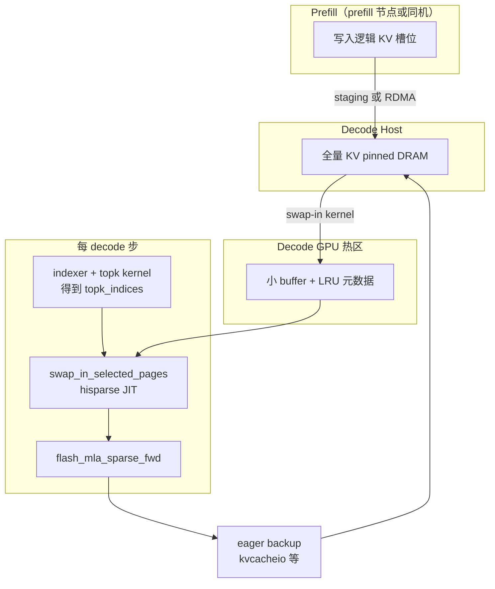

# HiSparse 完整工作流程（中文）

本文档说明 SGLang 中 **HiSparse（Hierarchical Sparse Attention）** 从请求进入、KV 驻留、到 decode 每步 **top-k 选择** 与 **注意力计算** 的端到端流程；并说明与 **NSA 注意力后端**、**其它注意力后端** 以及 **CUDA kernel** 的关系。

> 前置阅读：[`hisparse_guide.md`](./hisparse_guide.md)（部署参数与入门）。  
> 与 Quest + Qwen 相关的扩展设计见 [`hisparse_quest_qwen_design.md`](./hisparse_quest_qwen_design.md)（实验路径，与下文「生产路径：DSA + NSA」并列理解）。

---

## 1. 目标与内存分层

HiSparse 要解决的是：**decode 阶段每个请求不再在 GPU 上持有全长 KV**，而是：

| 层级 | 存放内容 | 典型规模 |
|------|----------|----------|
| **Host（CPU pinned DRAM）** | 该请求 **全量** KV（prefill 后写入） | 与 `host_to_device_ratio × device_pool` 及并发有关 |
| **Device「热区」buffer** | 每请求固定长度的小窗口（`device_buffer_size` 量级） | 仅数千 token 槽位 |
| **逻辑槽位 → 热区槽位映射** | `full_to_hisparse_device_index_mapping` 等 | 由 allocator / coordinator 维护 |

decode 每一步只对 **top_k 个历史 token**（由稀疏策略选出）在热区内做 attention；未命中的 KV 从 **host → device** 按需换入。

---

## 2. 请求生命周期（调度与 I/O）

实现入口主要在：

- `python/sglang/srt/managers/hisparse_coordinator.py` — **MLA / DSA** 路径的 `HiSparseCoordinator`
- `python/sglang/srt/disaggregation/decode.py` — PD decode 侧 **direct-to-host** 或 staging
- `python/sglang/srt/managers/scheduler_output_processor_mixin.py` — 请求结束释放资源

### 2.1 Prefill 之后：KV 进入 Host

两条常见路径：

1. **Staging（单机或非 RDMA 直写）**  
   `admit_request_into_staging`：prefill 产生的 KV 先在 GPU，再通过 `MLATokenToKVPoolHost.backup_from_device_all_layer(..., io_backend="kernel")` 异步拷到 host。

2. **Direct-to-host（PD 解耦 decode）**  
   `admit_request_direct`：prefill 节点已通过 RDMA 把 KV 写入 decode 侧 host pool；decode 侧只分配小 **device buffer**，长序列时把热区槽位标空，迫使后续每步走 swap-in。

### 2.2 每步 decode：槽位与备份

- `map_last_loc_to_buffer`：新 token 写入热区保留槽、更新 `full_to_hisparse_device_index_mapping`。
- `_eager_backup_previous_token`：上一步 token 的 KV 从 device **备份到 host**（与 swap-in 方向相反），保证 host 上始终有全量历史。

### 2.3 请求结束

`request_finished`：释放 device buffer、host 槽位、清零 per-request 的 LRU / 映射等。

---

## 3. Top-k 是怎么来的？（重点：DSA 生产路径）

在 **DeepSeek DSA（原生稀疏注意力）** 且启用 HiSparse 的推荐配置下，decode 使用 **`flashmla_sparse` NSA 后端**。此时 **top-k 不是 HiSparse 自己算的**，而是模型自带的 **NSA indexer（lightning indexer）** 根据当前 query 与 indexer 权重、KV 片段等算 **重要性分数**，再取 top-k **token 位置**。

代码关系概览：

1. **Indexer 前向**（`python/sglang/srt/layers/attention/nsa/nsa_indexer.py`）  
   - 在模型 forward 中与 attention 协同；内部大量使用 **矩阵乘（如 DeepGEMM）**、自定义算子、部分路径上 **Triton / 融合 kernel**（如 index cache 写入 `fused_store_index_k_cache` 等）。  
   - 输出可理解为「每个 query 位置对若干 KV 位置的打分 / logits」。

2. **Top-k 变换**（`python/sglang/srt/layers/attention/nsa_backend.py` 中 `topk_transform` 等）  
   - 在得到 logits 后，调用 **`fast_topk_v2`** 或 **`fast_topk_transform_fused` / `fast_topk_transform_ragged_fused`**（见 `nsa_backend.py` 顶部 import），这些是 **单独的 Triton/融合实现**，用于在变长 batch 上高效取 top-k。  
   - 与「下面要说的 HiSparse swap-in kernel」是 **不同的一套 kernel**。

3. **得到 `topk_indices`**  
   - 形状与 batch、head、配置中的 `top_k` 一致；语义为 **逻辑 token 下标**（在 HiSparse 下后续会配合 `seq_lens` 使用）。

**小结（DSA）**：**top-k 选择 = NSA indexer 相关计算（大量 GEMM + 辅助 kernel）+ topk 专用 Triton/融合 kernel**；**不是** `hisparse.cuh` 里那一个 kernel 的职责。

---

## 4. HiSparse 的 swap-in：几个 kernel？

### 4.1 核心：一个 JIT 编译的 CUDA kernel（按模板参数实例化）

Host → Device 热区、LRU、命中检测、按 token 搬运 MLA 条目的逻辑在：

- `python/sglang/jit_kernel/csrc/hisparse.cuh` — 设备函数 **`load_cache_to_device_buffer_kernel`**
- `python/sglang/jit_kernel/hisparse.py` — **`load_cache_to_device_buffer_mla`**（及 MHA 变体 `load_cache_to_device_buffer_mha`）

通过 `load_jit("sparse_cache", ..., cuda_files=["hisparse.cuh"], ...)` **按** `block_size`、`NUM_TOP_K`、`HOT_BUFFER_SIZE`、`IsMLA` **等模板参数各编译一份**。对单次 decode、单层、一批请求而言，调用的是 **这一支里的一个 global kernel**（内部多 warp 协作），而不是「几十个独立的小 kernel 串行」。

### 4.2 与 swap-in 配套的其它 I/O

- **Staging / backup 全层 MLA**：`HiSparseCoordinator` 使用 `sgl_kernel.kvcacheio.transfer_kv_all_layer_mla`（**另一套** sgl-kernel 里的批量搬运，与 `hisparse.cuh` 的 top-k swap-in **不同**）。
- **Host 侧 `io_backend="kernel"`** 时，`MLATokenToKVPoolHost` / `MHATokenToKVPoolHost` 内还有 **按层 / 按路径区分的 kernel 或 memcpy**（与 HiSparse swap-in 仍是不同入口）。

**小结（kernel 数量）**：  
- **Top-k 选点**：indexer + topk Triton/融合（多块逻辑）。  
- **HiSparse 换入**：**一个（模板实例化的）`load_cache_to_device_buffer` CUDA kernel** 为主路径。  
- **备份 / staging**：**另外的** kvcacheio 或 host pool 内 kernel。

---

## 5. NSA 注意力后端里：HiSparse 插在哪？

实现文件：`python/sglang/srt/layers/attention/nsa_backend.py`。

### 5.1 Decode（`forward_decode`，`flashmla_sparse`）

典型顺序：

```
topk_indices（indexer + topk 变换得到，token 级）
        ↓
若 forward_batch.hisparse_coordinator 非空：
    page_table_1 = hisparse_coordinator.swap_in_selected_pages(
        req_pool_indices, seq_lens, topk_indices, layer_id)
    （内部调用 JIT：load_cache_to_device_buffer_*）
        ↓
_forward_flashmla_sparse(q_all, kv_cache, page_table_1, ...)
    （sgl_kernel.flash_mla.flash_mla_sparse_fwd）
```

即：

1. **先**用 HiSparse 把本步需要的 KV **换到 device 热区**，并把 `topk_indices` 转成 **热区内可用的 device 槽位索引**（`page_table_1`）。
2. **再**调用 **FlashMLA sparse 前向**（`flash_mla_sparse_fwd`），在 **压缩后的 KV 视图** 上做稀疏 attention。

`flash_mla_sparse_fwd` 与 `hisparse.cuh` **是两个不同子系统**：前者是 **注意力计算**，后者是 **KV 搬运与地址整理**。

### 5.2 Prefill / Extend（`forward_extend`，`flashmla_sparse`）

在得到 `page_table_1` / `topk_indices` 等之后，若存在 `hisparse_coordinator`，会执行：

```text
page_table_1 = token_to_kv_pool.translate_loc_to_hisparse_device(page_table_1)
```

即把 **逻辑页表/索引** 映射到 **HiSparse device buffer** 上的物理位置，再进入同一套 `flashmla_sparse` 等实现。prefill 阶段一般不跑 swap-in kernel（KV 仍在 GPU 全量路径上），但 **页表语义**已与 decode 侧 HiSparse 寻址对齐。

### 5.3 其它 NSA decode 实现（`flashmla_kv` / `tilelang` / `fa3` / `trtllm`）

同一文件里分支不同；**HiSparse 当前官方文档要求的是 `flashmla_sparse`**。其它实现与 HiSparse 的接法不完全相同，部分路径有 `todo hisparse` 注释，属于扩展面。

---

## 6. 与「现有注意力后端」的关系

可以把它理解成 **三层**：

| 层级 | 角色 | 典型实现 |
|------|------|----------|
| **模型 + 稀疏策略** | 是否稀疏、如何选 top-k | DSA：`nsa_indexer` + `topk_transform` |
| **HiSparse I/O 子系统** | Host 全量 KV、Device 热区、按 top-k **换入** | `HiSparseCoordinator` + `hisparse.cuh` JIT |
| **注意力后端** | 在给定 `page_table`/KV 上算 QK^T V | DSA HiSparse：**`NSAttnBackend` + `flash_mla_sparse_fwd`** |

- **DSA 模型**：整条链走 **`NSAttnBackend`**（不是 FlashAttention3 那条 `FlashAttnBackend`）。HiSparse 是在 **NSA 后端内部** 对 `page_table_1` 做 **swap-in / translate**，再交给 **FlashMLA sparse**。  
- **稠密模型（如 Qwen）**：默认 attention 是 **FA3**（`flashattention_backend.py`）；若在仓库中启用 Quest + HiSparse 实验路径，则 top-k 由 **Quest 等算法** 提供，换入仍可用 **同一套 `hisparse` JIT**，但 **注意力算子** 仍是 **FA3 的 `flash_attn_with_kvcache`**，与 NSA 的 `flash_mla_sparse_fwd` **不是同一个 kernel**。

**Quest + FA3 + HiSparse（MVP）与 `page_size`：** 设计文档 [`hisparse_quest_qwen_design.md`](./hisparse_quest_qwen_design.md) §1.4 约定：**server 侧 `--page-size 1`**，使 FA3 的 `page_table` 保持 **token 级槽位**，稀疏 adaptor 与 Quest 在 `hisparse-config` 里配置的 **Quest 稀疏页大小**（如 16）解耦；`--page-size > 1` 与当前 HiSparse token 换入方式组合暂不纳入 MVP。

关系一句话：**HiSparse 是「KV 分层存储 + 按 top-k 换入」的基础设施；NSA 后端是「在换入后的槽位上做 DSA 稀疏 attention」的一种注意力实现；二者通过 `page_table_1` / `topk_indices` 在 `nsa_backend.py` 里粘合。**

---

## 7. 端到端数据流（DSA + HiSparse + flashmla_sparse）



---

## 8. 配置与约束（与 `hisparse_guide.md` 一致处）

- **`--enable-hisparse`**：在 decode 侧打开 HiSparse。  
- **`--hisparse-config`**：`top_k`、`device_buffer_size`、`host_to_device_ratio` 等。  
- **DSA + HiSparse 当前约束**：`flashmla_sparse` NSA 前后端、`bfloat16` KV、`--disable-radix-cache` 等（以 `server_args` 校验为准）。

---

## 9. 术语对照

| 中文 | 代码中常见英文名 |
|------|----------------|
| 热区 / device buffer | `device_buffer_size`、`req_to_device_buffer`、hisparse device pool |
| 全量 host KV | `MLATokenToKVPoolHost` / `req_to_host_pool` |
| Top-k 索引 | `topk_indices` → swap 后 `page_table_1`（device 槽位） |
| Swap-in kernel | `load_cache_to_device_buffer`（`hisparse.cuh`） |
| 稀疏 attention kernel | `flash_mla_sparse_fwd`（FlashMLA） |

---

文档内容随代码演进，类名与路径以当前仓库源码为准。
